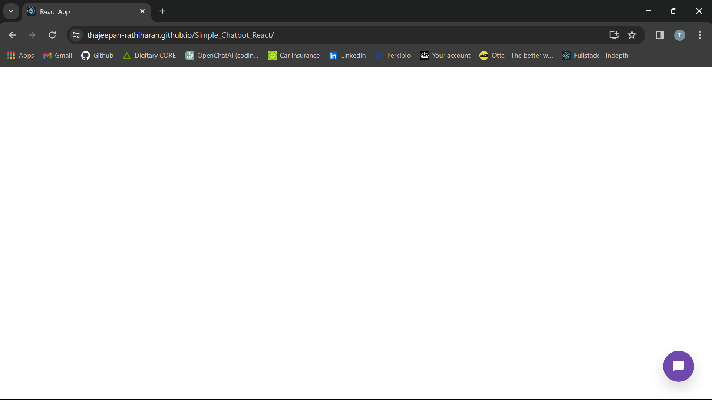
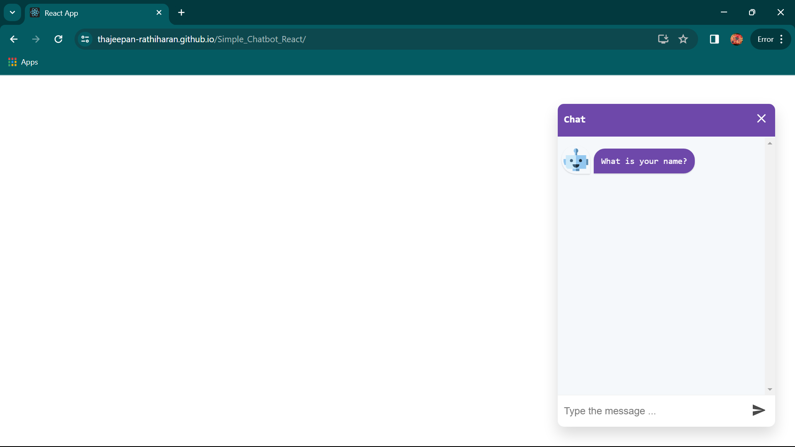
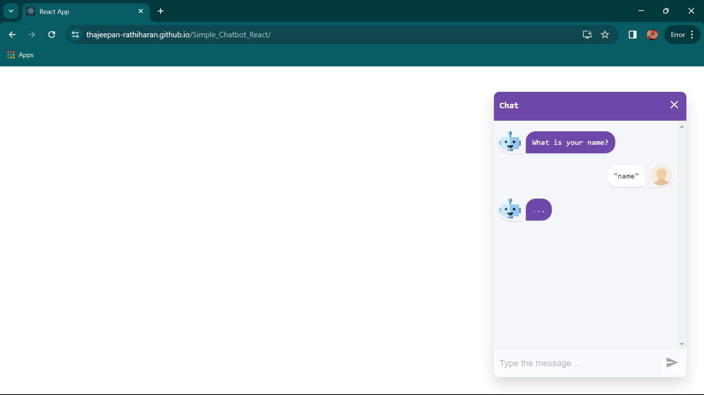
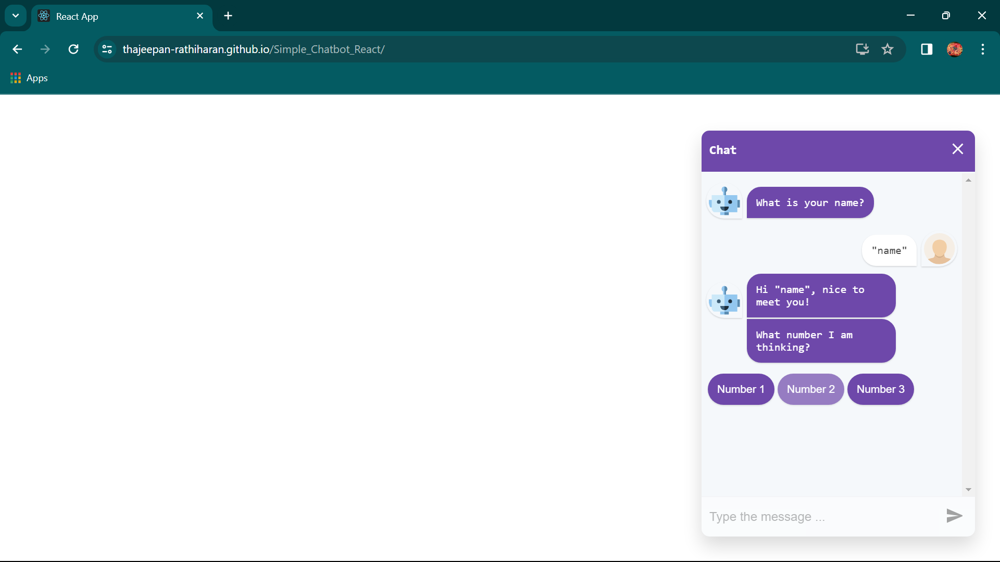
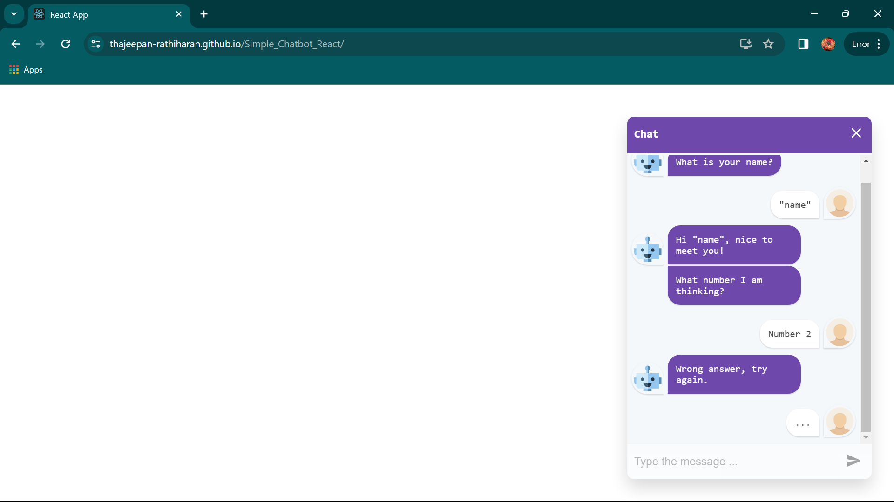
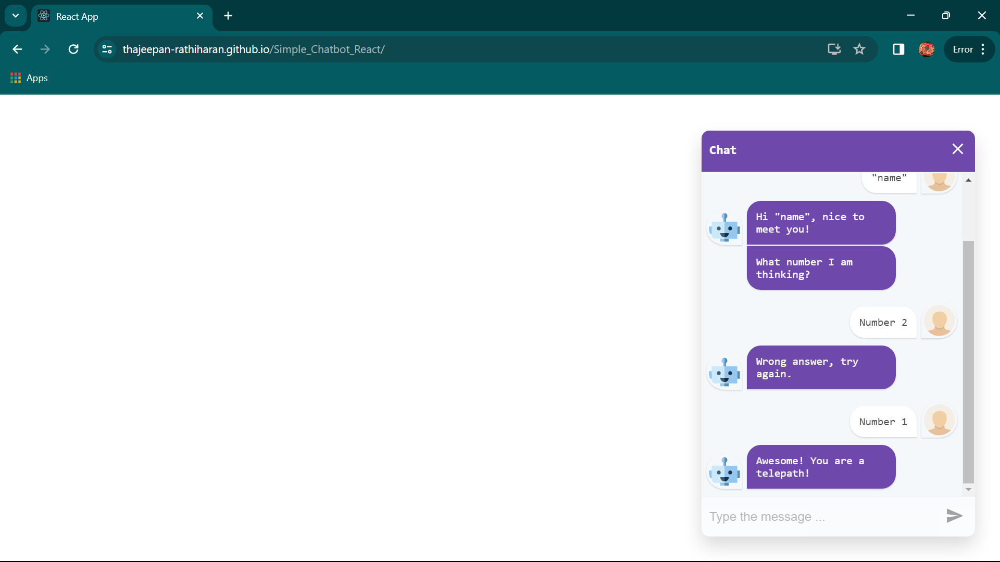

# Simple Chatbot made using React
This is a chatbot I made using React. [Here is the link to the final product.](https://thajeepan-rathiharan.github.io/Simple_Chatbot_React/)

## Software used
- React
- HTML
- CSS
- JavaScript
- Visual Studio Code
- Git

npx create-react-app chatbot-app was used to create the react app.

npm add react-simple-chatbot was used to add the chatbot to the react app.

# Demo 
1. How the react app looks upon clicking the link.

2. How the chat looks like when it gets opened.

3. User typing in the chat to answer the bot.

4. Bot responding.

5. Bot responding and asking a question.

6. Bot responding to answer chosen by user.

7. Last message between user and bot.

