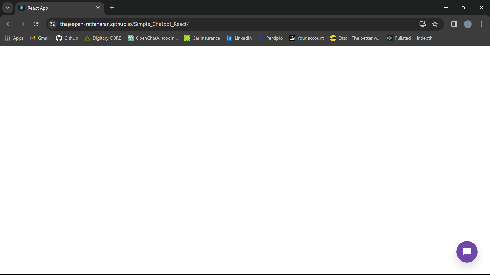
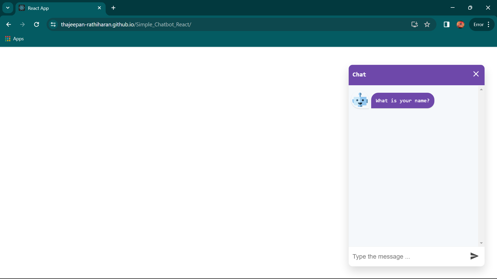
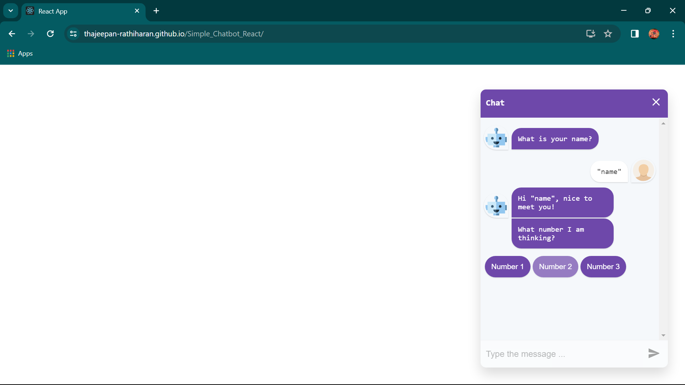
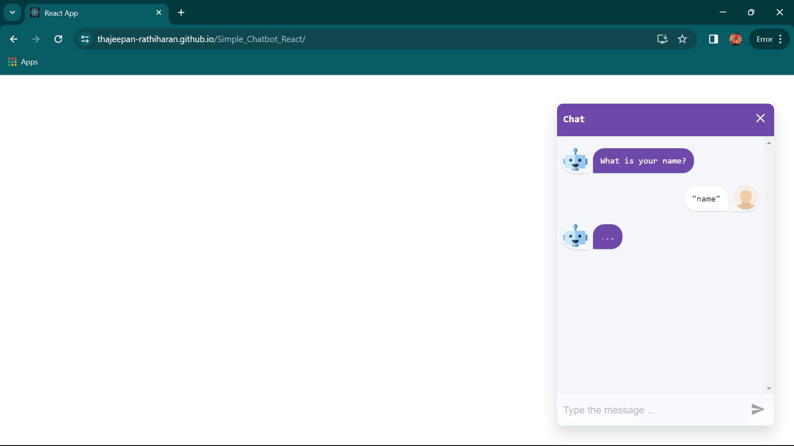
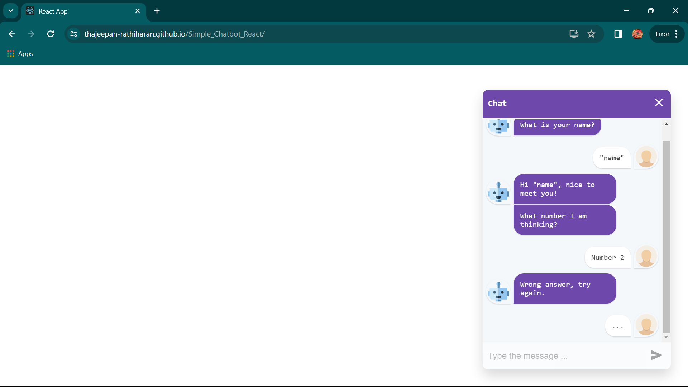
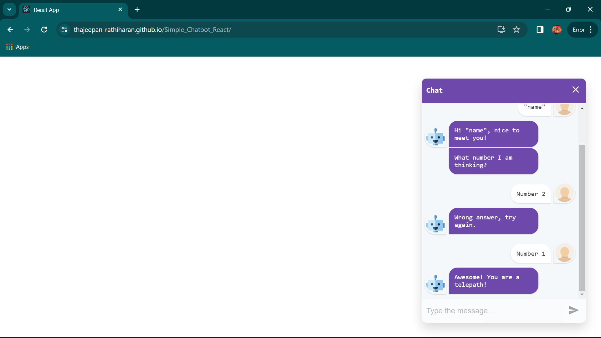

# Simple Chatbot made using React
This is a chatbot I made using React. [Here is the link to the final product.](https://thajeepan-rathiharan.github.io/Simple_Chatbot_React/)

## Software used
- React
- HTML
- CSS
- JavaScript
- Visual Studio Code
- Git

npx create-react-app chatbot-app

npm add react-simple-chatbot

